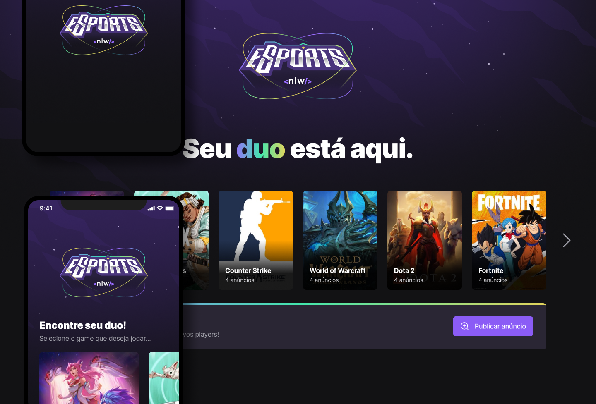

# NLW eSports
 

  

 

<h4 align="center"> 
  🚀 The <strong>eSports</strong> project on the <a href="https://lp.rocketseat.com.br/nlw">Next Level Week</a> by Rocketseat. 🚀
</h4>
 

  	
  
  
  
  

 

## Guide
 

  - [Description](#description)
  - [Stack and tools](#stack-and-tools)
  - [License](#license)

 

## Description
 

 - The project is called *Find your Duo*.
 - Next Level Week, also known as NLW, is a week where we develop an entire application. It is divided into two tracks, **"Explorer"** *(for those are new to programming)* and **"Ignite"** *(for those who already develop)*.
 - It is a platform to find the perfect partner to play your favorite game together, by connecting your Twitch.tv account.

 

  

&nbsp;

## Stack and tools
 

#### Front-end

* [React](https://reactjs.org/)
* [React Native](https://reactnative.dev/)
* [React Navigation](https://reactnavigation.org/)
* [Expo](https://expo.dev/)
* [Vite](https://vitejs.dev/)
* [RadixUI](https://www.radix-ui.com/)
* [Tailwind](https://tailwindcss.com/)
* [Phosphor](https://phosphoricons.com/)
* [Figma](https://www.figma.com/)

#### Back-end

* [Node.js](https://nodejs.org/en/)
* [Prisma](https://www.prisma.io/)
* [Express](https://expressjs.com/pt-br/)
* [Cors](https://www.npmjs.com/package/cors)

&nbsp;

## License
 

This project is under the MIT license. See the [LICENSE](LICENSE) for details.